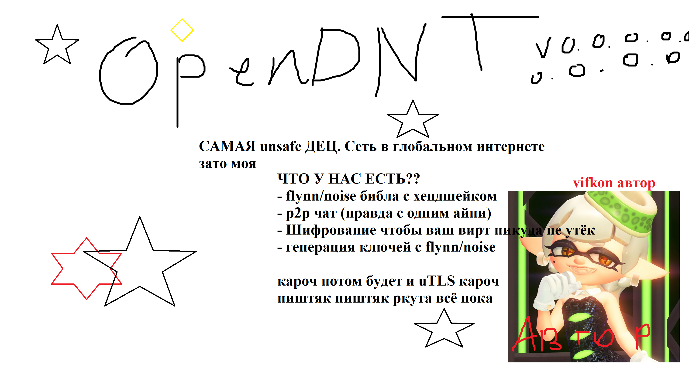



# OpenDNT

Анонимизирующая P2P-сеть, вдохновлённая I2P, но на onion routing (полный туннель, не garlic). Задумана для использования в России - приоритет на устойчивость к DPI-блокировкам и низкую задержку, а не на максимальную анонимность любой ценой.

## ⚠️ Текущий статус: ничего не работает!!!

Это дизайн-документ и roadmap проекта на самой ранней стадии. На данный момент реализован только `main.go`. Ниже - честный список того, что есть, и того, что только запланировано.

### Реализовано
- [x] Генерация ключей с библиотекой flynn/noise. Позже будет задействовано с хендшейком.
- [x] Handshake между двумя узлами
- [x] Шифрование
- [x] Базовая передача сообщений (p2p)

### В процессе / следующий шаг
- [ ] TCP+TLS транспорт
- [ ] Маскировка трафика под HTTPS: uTLS с фингерпринтом браузера

### Запланировано (архитектура, ничего не закодировано)
- [ ] Однохоповый relay
- [ ] Многохоповые туннели (~3 случайных узла, многослойное шифрование, ответ через ту же цепочку)
- [ ] Discovery через Kademlia DHT
- [ ] Bridge-узлы (адреса не публикуются в открытом DHT)
- [ ] Защита от active probing DPI

## Идея и trade-off'ы (дизайн, не реализация)

Приоритет на низкую задержку - осознанный компромисс:

- Релеи предполагаются географически ближе к России, а не по всему миру, как в Tor/I2P - это должно снижать пинг, но потенциально облегчает корреляционные атаки для наблюдателя, контролирующего значительную часть сети внутри региона
- Число хопов планируется держать минимальным (~3)

Ни один из этих пунктов пока не протестирован и не реализован - это только план.

## Стек

- Язык: Go
- Планируемые библиотеки: `refraction-networking/utls`

## Donutы на мои кошелёчки

Если хотите поддержать разработку (проект на очень ранней стадии, без гарантий результата):

- BTC: bc1qlpugeupeqdgnsgwuwep6rzetkmp7ju2azveylz
- ETH: 0x10eD7AD573a67d34759A37C4De2a5B4353121A4f
- POL: 0x10eD7AD573a67d34759A37C4De2a5B4353121A4f

## Дисклеймер

Хобби-проект. Делается по приколу и в процессе обучения Go/сетям - не production-ready решение, не используйте это для реальной защиты от слежки, пока не появится хотя бы работающий прототип с аудитом.

Все узлы не из России будут автоматически фильтроваться каждым узлом в сети.

Для релейщиков ваще отдельное предупреждение. Прошу вас, учтите что ВСЮ ответственность за траффик, проходящего через вас, несёте только вы.