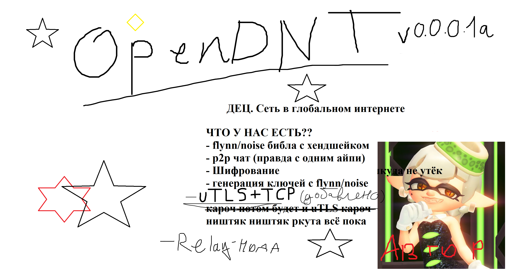



# OpenDNT - Мы не прячемся! Чтобы заблокировать нас, придётся заблокировать обычный HTTPS

P2P-сеть, вдохновлённая I2P, но на onion routing (полный туннель, не garlic). Задумана для использования в России - приоритет на устойчивость к DPI-блокировкам и низкую задержку, а не на максимальную анонимность любой ценой.

## ⚠️ Текущий статус: ничего не работает!!! (почти ничего). v0.0.0.1a

Это дизайн-документ и roadmap проекта на самой ранней стадии. Ниже - честный список того, что есть, и того, что только запланировано.

### Реализовано
- [x] Генерация ключей с библиотекой flynn/noise
- [x] Handshake между двумя узлами
- [x] Шифрование
- [x] Базовая передача сообщений (p2p)
- [x] TCP+uTLS транспорт с маскировкой под браузерный TLS-фингерпринт
- [x] Accept-цикл на сервере не роняет процесс от левых подключений (не-протокольный трафик просто отбрасывается)
- [x] Персистентность статического keypair на диск
- [x] Однохоповый relay
- [x] Сквозное шифрование
- [x] Закрепление публичного ключа цели (pinning, флаг `-targetkey`)

### В процессе / следующий шаг
- [ ] Цепочка из двух релеев (заданных вручную)
- [ ] Таймауты и allow-list на релее

### Запланировано (архитектура, ничего не закодировано)
- [ ] Решение про фиксированный размер ячейки и паддинг
- [ ] Локальная таблица известных пиров (адрес + ключ) и случайный выбор хопов
- [ ] Многохоповые туннели (~3 узла, пул готовых туннелей, время жизни)
- [ ] Discovery через Kademlia DHT
- [ ] Bridge-узлы (адреса не публикуются в открытом DHT)
- [ ] Защита от active probing DPI (камуфляж при провале хендшейка и дальше)

## Идея и trade-off'ы (дизайн, не реализация)

Приоритет на низкую задержку - осознанный компромисс:

- Релеи предполагаются географически ближе к России, а не по всему миру, как в Tor/I2P - это должно снижать пинг, но потенциально облегчает корреляционные атаки для наблюдателя, контролирующего значительную часть сети внутри региона
- Число хопов планируется держать минимальным (~3)

Ни один из этих пунктов пока не протестирован и не реализован - это только план.

## Как запустить и проверить?

```bash
git clone https://github.com/wiksadeey/OpenDNT.git
cd OpenDNT
go mod tidy
```

Чат между A и C через релей B. Три терминала, запускать по порядку:

```bash
# B (релей)
go run . -mode relay -addr :9000 -key ./keys/b.key

# C (конечный узел): в логе строка "Публичный ключ: <hex>" - он нужен клиенту
go run . -mode listen -addr :9001 -key ./keys/c.key

# A (клиент): -targetkey - ключ C из его лога (лучше передавать не через релей)
go run . -mode dial -relayaddr 127.0.0.1:9000 -addr 127.0.0.1:9001 -key ./keys/a.key -targetkey <hex ключа C>
```

Что напишешь в A, появится в C, и наоборот. Ключи создаются сами при первом запуске, у каждого узла свой `-key`. Файлы ключей не коммитить.

Релей пока открытый: без ограничений на адреса назначения и без таймаутов. Только для тестов.

## Стек

- Язык: Go
- `flynn/noise` - Noise_XX хендшейк и шифрование
- `refraction-networking/utls` - TCP-транспорт с ClientHello под браузер

## Donutы на мои кошелёчки

Если хотите поддержать разработку (проект на очень ранней стадии, без гарантий результата):

- BTC: bc1qlpugeupeqdgnsgwuwep6rzetkmp7ju2azveylz
- ETH: 0x10eD7AD573a67d34759A37C4De2a5B4353121A4f
- POL: 0x10eD7AD573a67d34759A37C4De2a5B4353121A4f

## Дисклеймер

Хобби-проект. Делается по приколу и в процессе обучения Go/сетям - не production-ready решение, не используйте это для реальной защиты от слежки, пока не появится хотя бы работающий прототип с аудитом.

Для релейщиков ваще отдельное предупреждение. Прошу вас, учтите что ВСЮ ответственность за траффик, проходящего через вас, несёте только вы.